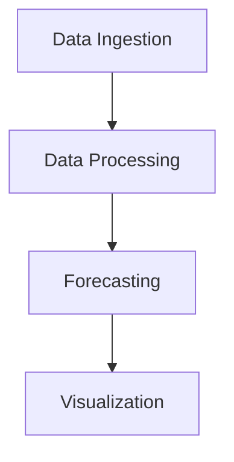

# Architecture Overview

This diagram illustrates the components of the Retail Demand Forecasting System:
- **Data Ingestion**: The process of collecting data from various sources.
- **Data Processing**: Transforming and cleaning the data for analysis.
- **Forecasting**: Applying algorithms to predict future demand based on past data.
- **Visualization**: Presenting the forecast results in an intuitive format.