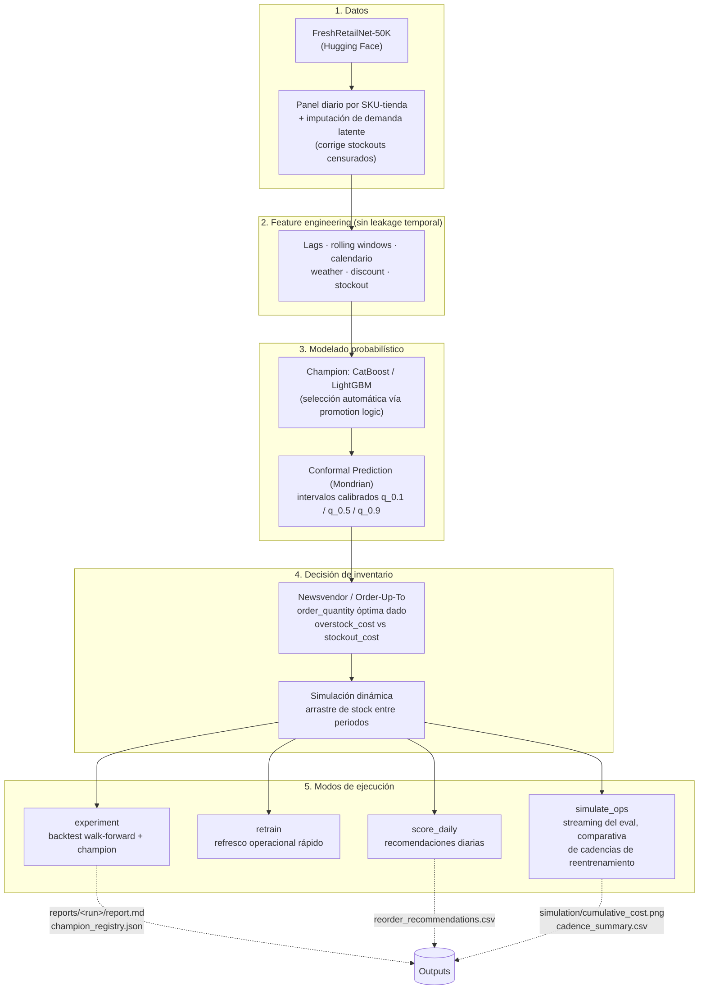

# Sistema Inteligente de Soporte a la Decisión (DSS) para Retail

Este repositorio contiene un sistema de nivel industrial para el forecasting de demanda y la optimización de reposición en retail, desarrollado para un TFG. El proyecto evoluciona desde el aprendizaje automático estadístico hasta un **Sistema de Apoyo a la Decisión (DSS) End-to-End** que resuelve problemas de inventario bajo restricciones reales, incertidumbre calibrada y estándares MLOps.

## Mapa general del sistema

El pipeline transforma datos brutos de ventas en recomendaciones operacionales de reposición. Cada bloque resuelve un problema concreto del dominio retail, no es código por código:



**Decisiones de diseño clave** (la sustancia académica del TFG):

1. **Demanda latente vs observada** — cuando una serie se queda sin stock, las ventas observadas subestiman la demanda real. El imputador corrige este sesgo de censura.
2. **Conformal prediction** — los modelos boosting no producen intervalos calibrados de fábrica. La capa conformal añade garantías estadísticas de cobertura sin reentrenar.
3. **Target = lead-time demand agregada** — el modelo predice la demanda *acumulada* en los próximos H días, no un valor por día. Alinea el output con la decisión real (reposición) en lugar de optimizar MAPE diario.
4. **Newsvendor con critical fractile** — la cantidad óptima a pedir no es la media; se calcula del cuantil que minimiza el coste esperado dado el ratio overstock/stockout.
5. **Cuatro modos de ejecución** — separación entre investigación (`experiment`, `simulate_ops`) y producción (`retrain`, `score_daily`) siguiendo prácticas MLOps estándar.

## Características de Excelencia Académica e Industrial

1.  **Mondrian Conformal Prediction:** Garantías matemáticas de cobertura de intervalos de confianza condicionadas por categoría de producto, asegurando equidad en el pronóstico.
2.  **Optimización Multi-Objetivo (NSGA-II):** Sintonización con Optuna buscando el Frente de Pareto entre precisión puntual (MAE) y nitidez probabilística (Winkler Score).
3.  **Simulación Dinámica (s, S):** Gemelo digital logístico que arrastra el stock remanente y pendientes (*backlog*) entre periodos para medir el verdadero impacto económico (Efecto Látigo).
4.  **Optimización bajo Restricciones:** Resolución de escasez global de presupuesto o volumen mediante Programación Lineal (*Continuous Knapsack*) utilizando SciPy.
5.  **Ecosistema MLOps Profesional:**
    *   **MLflow:** Registro automático de experimentos, parámetros y artefactos visuales (SHAP, Pareto).
    *   **FastAPI:** Despliegue como microservicio productivo para integración con ERPs.
    *   **Post-Mortem Analysis:** Módulo de autodiagnóstico algorítmico que explica fallos por drift, intermitencia o ruido.
    *   **Docker & CI/CD:** Arquitectura 100% reproducible y protegida por GitHub Actions.

## Inicio Rápido con Docker (Recomendado)

Levanta todo el ecosistema (API + Dashboard + MLflow) con un solo comando:

```bash
docker compose up
```

- **Dashboard What-If:** `http://localhost:8501`
- **MLflow Tracking:** `http://localhost:5000`
- **API Documentation:** `http://localhost:8000/docs`

## Instalación Local (Desarrollo)

El proyecto utiliza `uv` para la gestión de dependencias.

```bash
# 1. Instalar dependencias
make install

# 2. Ejecutar experimento completo y registrar en MLflow
make run

# 3. Lanzar servicios individualmente
make api        # Levanta FastAPI
make dashboard  # Levanta Streamlit
make mlflow     # Levanta UI de MLflow
```

## Suite de Verificación

```bash
# Ejecutar los 83 tests automatizados
make test
```

---
*Este proyecto es parte de un Trabajo de Fin de Grado (TFG) centrado en la excelencia en ingeniería y rigor estadístico.*
