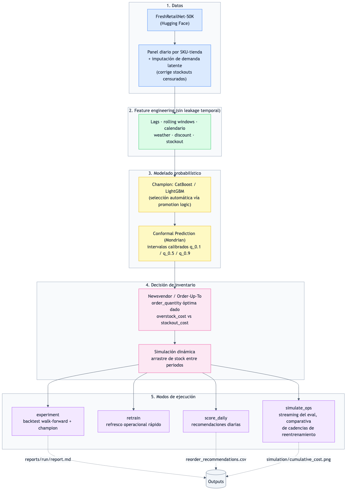

# Sistema Inteligente de Soporte a la Decisión (DSS) para Retail

Este repositorio contiene un sistema de nivel industrial para el forecasting de demanda y la optimización de reposición en retail, desarrollado para un TFG. El proyecto evoluciona desde el aprendizaje automático estadístico hasta un **Sistema de Apoyo a la Decisión (DSS) End-to-End** que resuelve problemas de inventario bajo restricciones reales, incertidumbre calibrada y estándares MLOps.

## Mapa general del sistema

El pipeline transforma datos brutos de ventas en recomendaciones operacionales de reposición. Cada bloque resuelve un problema concreto del dominio retail, no es código por código:



**Decisiones de diseño clave** (la sustancia académica del TFG):

1. **Demanda latente vs observada** — cuando una serie se queda sin stock, las ventas observadas subestiman la demanda real. El imputador corrige este sesgo de censura.
2. **Conformal prediction** — los modelos boosting no producen intervalos calibrados de fábrica. La capa conformal añade garantías estadísticas de cobertura sin reentrenar.
3. **Target = lead-time demand agregada** — el modelo predice la demanda *acumulada* en los próximos H días, no un valor por día. Alinea el output con la decisión real (reposición) en lugar de optimizar MAPE diario.
4. **Newsvendor con critical fractile** — la cantidad óptima a pedir no es la media; se calcula del cuantil que minimiza el coste esperado dado el ratio overstock/stockout.
5. **Cuatro modos de ejecución** — separación entre investigación (`experiment`, `simulate_ops`) y producción (`retrain`, `score_daily`) siguiendo prácticas MLOps estándar.

## Características de Excelencia Académica e Industrial

1. **Mondrian Conformal Prediction:** Garantías matemáticas de cobertura de intervalos de confianza condicionadas por categoría de producto, asegurando equidad en el pronóstico.
2. **Optimización Multi-Objetivo (NSGA-II):** Sintonización con Optuna buscando el Frente de Pareto entre precisión puntual (MAE) y nitidez probabilística (Winkler Score).
3. **Decisión de Inventario Newsvendor:** Traducción de la distribución predicha en una cantidad de pedido por origen de predicción, usando el fractil crítico que fija la asimetría entre coste de rotura y coste de sobrestock.
4. **Ecosistema MLOps Profesional:**
   * **Django:** Dashboard renderizado en servidor y API operacional JSON para integración con ERPs.
   * **Post-Mortem Analysis:** Módulo de autodiagnóstico algorítmico que explica fallos por drift, intermitencia o ruido.
   * **Docker & CI/CD:** Arquitectura 100% reproducible y protegida por GitHub Actions.

## Inicio Rápido con Docker (Recomendado)

Levanta el ecosistema (dashboard + API) con un solo comando:

```bash
docker compose up
```

- **Dashboard:** `http://localhost:8000`
- **API Documentation:** `http://localhost:8000/api/`

### Variables de entorno

El dashboard no usa base de datos: las sesiones son cookies firmadas con
`DJANGO_SECRET_KEY`. Copia `.env.example` a `.env` y rellénalo. En producción es
obligatorio fijar `DJANGO_SECRET_KEY`, `DJANGO_ALLOWED_HOSTS` y `AUTH_PASSWORD`
(un `AUTH_PASSWORD` vacío deshabilita el acceso).

## Instalación Local (Desarrollo)

El proyecto utiliza `uv` para la gestión de dependencias.

```bash
# 1. Instalar dependencias
make install

# 2. Ejecutar el experimento completo
make run

# 3. Levantar el dashboard (UI + API operacional)
make dev

```

## Suite de Verificación

```bash
# Ejecutar los 123 tests automatizados
make test
```

---

*Este proyecto es parte de un Trabajo de Fin de Grado (TFG) centrado en la excelencia en ingeniería y rigor estadístico.*
