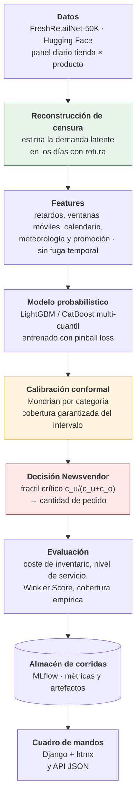

# Sistema de Apoyo a la Decisión para Reposición en Retail

Sistema de previsión de demanda y decisión de inventario para retail de producto fresco,
desarrollado como Trabajo de Fin de Grado. No se limita a predecir: convierte una previsión
probabilística calibrada en **cuántas unidades pedir** de cada producto en cada tienda, bajo
incertidumbre, roturas de stock y deriva temporal.

El problema de fondo es que las ventas registradas **no son la demanda**: cuando un producto se
agota, la venta queda truncada por debajo de lo que los clientes querían comprar. Entrenar sobre
esa señal enseña al modelo a pedir de menos justo donde más falta hace. El sistema reconstruye la
demanda latente, la predice con intervalos de cobertura garantizada y traduce esos intervalos en
una cantidad de pedido óptima frente a la asimetría entre el coste de una rotura y el de un
sobrestock.

## Cómo funciona


```mermaid
flowchart TD
    A["<b>Datos</b><br/>FreshRetailNet-50K · Hugging Face<br/>panel diario tienda × producto"]
    B["<b>Reconstrucción de censura</b><br/>estima la demanda latente<br/>en los días con rotura"]
    C["<b>Features</b><br/>retardos, ventanas móviles, calendario,<br/>meteorología y promoción · sin fuga temporal"]
    D["<b>Modelo probabilístico</b><br/>LightGBM / CatBoost multi-cuantil<br/>entrenado con pinball loss"]
    E["<b>Calibración conformal</b><br/>Mondrian por categoría<br/>cobertura garantizada del intervalo"]
    F["<b>Decisión Newsvendor</b><br/>fractil crítico c_u/(c_u+c_o)<br/>→ cantidad de pedido"]
    G["<b>Evaluación</b><br/>coste de inventario, nivel de servicio,<br/>Winkler Score, cobertura empírica"]
    H[("<b>Almacén de corridas</b><br/>MLflow · métricas y artefactos")]
    I["<b>Cuadro de mandos</b><br/>Django + htmx<br/>y API JSON"]

    A --> B --> C --> D --> E --> F --> G
    G --> H
    H --> I

    style B fill:#e8f4ea,stroke:#4a7c59
    style E fill:#fff4e0,stroke:#b8860b
    style F fill:#fde8e8,stroke:#a94442
```

Cinco decisiones de diseño sostienen el trabajo:

1. **Demanda latente en lugar de venta observada.** Un día con rotura registra menos venta de la
   que hubo demanda. `LatentDemandImputer` reconstruye ese nivel a partir del contexto del día y
   de la severidad de la rotura.
2. **El objetivo es la demanda acumulada a lead time**, no la de un día suelto. Alinea lo que el
   modelo predice con la decisión que se toma de verdad: un pedido cubre varios días.
3. **Los intervalos se calibran, no se asumen.** Los modelos de *boosting* no producen cuantiles
   con cobertura garantizada; la capa conformal de Mondrian se la añade por estrato, sin
   reentrenar.
4. **La cantidad óptima no es la media.** El fractil crítico del Newsvendor fija qué cuantil de la
   distribución hay que cubrir según lo que cuesta quedarse corto frente a lo que cuesta pasarse.
5. **El criterio de selección es el coste, no el error.** El orden por MAE y el orden por coste
   logístico no coinciden, y el sistema promociona por el segundo.

## Puesta en marcha

Con Docker, que levanta el cuadro de mandos y la API:

```bash
docker compose up
```

- Cuadro de mandos: `http://localhost:8000`
- API documentada: `http://localhost:8000/api/`

El dashboard no usa base de datos de aplicación: las sesiones son cookies firmadas. Copia
`.env.example` a `.env` y rellénalo; en producción son obligatorios `DJANGO_SECRET_KEY`,
`DJANGO_ALLOWED_HOSTS` y `AUTH_PASSWORD` (dejarlo vacío deshabilita el acceso).

Para desarrollo local, con `uv` (Python 3.11 o superior):

```bash
make install   # dependencias y entorno virtual
make run       # experimento completo con la configuración por defecto
make dev       # cuadro de mandos y API en http://localhost:8000
```

`make help` lista todos los objetivos.

## Modos de ejecución

El sistema no es un script sino **ocho modos**, cada uno con su carpeta de configuración en
`configs/` y su objetivo propio. La separación entre investigación y producción es deliberada:

| Modo | Objetivo | Comando |
| --- | --- | --- |
| `experiment` | Backtest *walk-forward* y selección de campeón | `make run` |
| `retrain` | Reentrenar el campeón con todo el histórico | `make retrain` |
| `score_daily` | Recomendaciones de reposición del día | `make score` |
| `simulate_ops` | Backtest de origen rodante y cadencia de reentreno | `make simulate` |
| `fair_cost_backtest` | Ordenar las reconstrucciones contra una verdad común | `make backtest-fair-cost` |
| `tune_forecasting` | Búsqueda multiobjetivo de hiperparámetros del modelo | `make tune-forecasting` |
| `tune_imputation` | Búsqueda de hiperparámetros del imputador | `make tune-imputation` |
| `eda` | Análisis exploratorio reproducible | `make eda` |

## Trazabilidad

Toda ejecución, sea del modo que sea, abre una corrida de MLflow y escribe sus artefactos dentro
del directorio de esa corrida, junto con la configuración, el *commit* de Git y las métricas por
modelo y estrategia. No hay etapa de copia: escribir ahí *es* registrar.

```bash
make mlflow-ui   # explorar las corridas en http://localhost:5000
```

Las cifras que la memoria cita se resuelven por el nombre de su corrida, y `docs/runs.md` mantiene
la correspondencia entre cada resultado publicado y el *run* que lo produjo.

## Verificación

```bash
make test           # suite completa
make test-harness   # solo contratos y arquitectura (rápido)
make lint           # ruff
```

La suite no comprueba solo que el código funcione: hay tests dedicados a que **no haya fuga
temporal de información**, a que los contratos de los dataframes se respeten, a que los nombres
crudos del dataset no se escapen de su módulo y a que las capas de la arquitectura no se importen
entre sí. Los ganchos de Git ejecutan `ruff`, `ruff-format` y `mypy` en cada *commit*, y la suite
completa antes de cada *push*:

```bash
uv run pre-commit install --hook-type pre-commit --hook-type pre-push
```

## Documentación

`docs/` es el sistema de registro del proyecto: `invariants.md` recoge las invariantes que el
sistema debe cumplir y por qué, `contracts/dataframes.md` los esquemas que circulan entre capas,
`system_design.md` la arquitectura, `web_layer.md` el cuadro de mandos y `runs.md` la
correspondencia entre resultados publicados y corridas. La memoria del TFG se compila con
`make pdf`.

---

*Trabajo de Fin de Grado · Grado en Ciencia de Datos · ETSINF, Universitat Politècnica de València.*
