# Diseno metodologico del sistema

## Vision general

El sistema sigue una arquitectura modular orientada a experimentacion reproducible. Cada modulo responde a una etapa del ciclo de decision:

1. ingesta de datos;
2. preparacion del panel temporal;
3. analisis exploratorio reproducible del panel;
4. feature engineering sin leakage;
5. entrenamiento y forecasting;
6. decision de inventario;
7. evaluacion economica;
8. reporte y visualizacion.

### Flujo end-to-end

```mermaid
flowchart TD
    A["Config YAML<br/>configs/default.yaml"] --> B["load_config()<br/>typed Settings"]
    B --> C["run_experiment()"]

    C --> D["load_prepared_panel()<br/>FreshRetailNet train split"]
    D --> E["prepare_daily_panel()<br/>raw names isolated in data layer"]
    E --> F["Canonical panel<br/>date<br/>series_id<br/>observed_demand<br/>stockout_hours<br/>context/static ids"]

    F --> G["Strategy A<br/>observed demand"]
    F --> H["Strategy B<br/>latent demand imputation"]
    H --> H1["LatentDemandImputer<br/>optional imputed demand signal"]

    G --> I["run_experiment_from_frame()<br/>Observed"]
    H1 --> J["run_experiment_from_frame()<br/>Latent"]

    I --> K["label_stockout_regime()"]
    J --> L["label_stockout_regime()"]

    K --> M{"use_series_costs?"}
    L --> N{"use_series_costs?"}
    M -->|yes| M1["build_series_cost_profile()<br/>c_over<br/>c_under<br/>critical_fractile"]
    M -->|no| M2["global inventory costs"]
    N -->|yes| N1["build_series_cost_profile()<br/>same contract"]
    N -->|no| N2["global inventory costs"]

    K --> O["build_supervised_frame()"]
    L --> P["build_supervised_frame()"]
    O --> O1["Temporal features<br/>positive demand lags<br/>shifted rolling windows<br/>lagged stockout/discount/weather<br/>calendar/static features"]
    P --> P1["Temporal features<br/>same anti-leakage contract"]
    O1 --> Q["target_lead_time_demand<br/>sum demand from t to t+h-1"]
    P1 --> R["target_lead_time_demand<br/>same horizon"]

    Q --> S["build_walk_forward_folds()"]
    R --> T["build_walk_forward_folds()"]
    S --> U["Fold loop<br/>expanding temporal validation"]
    T --> V["Fold loop<br/>same fold semantics"]

    U --> U1["train_frame<br/>date <= train_end_date"]
    U --> U2["validation_frame<br/>validation_start_date to validation_end_date"]
    V --> V1["train_frame"]
    V --> V2["validation_frame"]

    U1 --> W["calibration split<br/>sub-train + calibration"]
    V1 --> X["calibration split"]

    W --> Y["Model families"]
    X --> Z["Model families"]
    Y --> Y1["Seasonal naive<br/>heuristic baseline"]
    Y --> Y2["Ridge baseline<br/>linear model"]
    Y --> Y3["Auto boosting<br/>LightGBM/XGBoost/sklearn fallback"]
    Y --> Y4["CatBoost"]
    Y --> Y5["Auto ARIMA"]

    Z --> Z1["Same model families<br/>latent strategy"]

    Y2 --> AA["ConformalForecaster<br/>optional calibration"]
    Y3 --> AA
    Y4 --> AA
    Y5 --> AA
    Z1 --> AB["ConformalForecaster<br/>optional calibration"]

    Y1 --> AC["Prediction frame"]
    AA --> AC
    AB --> AD["Prediction frame"]

    AC --> AC1["Forecast outputs<br/>y_pred<br/>q_* when available<br/>model_name<br/>backend_name<br/>fold_id"]
    AD --> AD1["Forecast outputs<br/>same schema"]

    AC1 --> AE["choose_order_quantity()"]
    AD1 --> AF["choose_order_quantity()"]
    AE --> AE1{"Quantiles available?"}
    AF --> AF1{"Quantiles available?"}
    AE1 -->|yes| AG["interpolate forecast quantile<br/>at critical_fractile"]
    AE1 -->|no| AH["order_quantity = y_pred"]
    AF1 -->|yes| AI["interpolate forecast quantile"]
    AF1 -->|no| AJ["order_quantity = y_pred"]

    AG --> AK["attach_inventory_costs()"]
    AH --> AK
    AI --> AL["attach_inventory_costs()"]
    AJ --> AL
    AK --> AK1["Inventory columns<br/>overstock_units<br/>stockout_units<br/>overstock_cost<br/>stockout_cost<br/>total_cost"]
    AL --> AL1["Inventory columns<br/>same schema"]

    AK1 --> AM["concatenate fold predictions<br/>Observed"]
    AL1 --> AN["concatenate fold predictions<br/>Latent"]
    AM --> AO["merge strategy predictions"]
    AN --> AO

    AO --> AP["summarize_predictions()"]
    AO --> AQ["summarize_costs()"]
    AO --> AR["run_sensitivity_analysis()"]
    AO --> AS["summarize_pareto_frontier()"]

    AP --> AP1["Predictive diagnostics<br/>MAE<br/>RMSE<br/>pinball loss<br/>coverage"]
    AQ --> AQ1["Economic summary<br/>total_cost<br/>mean_cost<br/>overstock units<br/>stockout units"]
    AR --> AR1["Cost-ratio sensitivity<br/>Cs/Co scenarios"]
    AS --> AS1["Candidate policies<br/>order_scale grid"]
    AS1 --> AS2["Evaluate each candidate<br/>candidate order quantity<br/>cost<br/>overstock<br/>stockout<br/>service level<br/>fill rate"]
    AS2 --> AS3["Pareto dominance<br/>minimize cost<br/>minimize overstock<br/>minimize stockout"]
    AS3 --> AS4["is_pareto_efficient"]

    AP1 --> AT["RunArtifacts"]
    AQ1 --> AT
    AR1 --> AT
    AS4 --> AT
    AO --> AT

    AT --> AU["write_run_artifacts()"]
    AU --> AU1["predictions.csv"]
    AU --> AU2["metrics_summary.csv"]
    AU --> AU3["fold_metrics.csv"]
    AU --> AU4["cost_summary.csv"]
    AU --> AU5["sensitivity_summary.csv"]
    AU --> AU6["pareto_frontier.csv"]
    AU --> AU7["report.md"]
    AU --> AU8["plots when enabled"]

    AU7 --> AV["Interpretation<br/>accuracy diagnostics + economic ranking"]
    AU6 --> AW["Multiobjective interpretation<br/>availability vs overstock/waste trade-off"]
```

## 1. Ingesta de datos

Fuente principal:

- `FreshRetailNet-50K` desde Hugging Face

La capa de datos:

- lee solo las columnas necesarias para la v1;
- cachea el split bruto en `data/raw/`;
- materializa un panel procesado en `data/processed/`.

Esto permite reproducibilidad y evita volver a descargar el dataset en cada ejecucion.

## 2. Preprocesamiento

El preprocesamiento transforma el split bruto en un panel diario limpio:

- parseo de fechas;
- renombrado semantico de columnas;
- eliminacion de duplicados;
- filtrado de ventas negativas si aparecen;
- construccion de `series_id = store_id + product_id`;
- filtrado de series con historia suficiente;
- seleccion configurable de las series mas relevantes por volumen.

La v1 usa demanda observada. Los stockouts no se corrigen aun para recuperar demanda latente; se mantienen como senal contextual.

## 3. EDA reproducible

El modulo `eda` opera exclusivamente sobre el panel preparado y no sobre nombres raw del dataset. Su objetivo es producir artefactos de analisis descriptivo auditables sin contaminar la logica de forecasting:

- resumen de cobertura temporal y continuidad por serie;
- perfilado tabular de missingness y variables numericas;
- resumenes de estacionalidad semanal;
- diagnosticos de frecuencia e intensidad de stockout;
- correlaciones descriptivas con `observed_demand`;
- reporte Markdown y plots bajo `reports/eda_*`.

## 4. Feature engineering temporal

### Principios

- ninguna feature puede usar informacion posterior a la fecha de decision;
- las covariables no observables ex ante solo entran como historico;
- el target se alinea con el horizonte de inventario.

### Features incluidas

- lags de demanda
- rolling mean, std y sum de demanda historica
- lags de descuento
- lags de stockout hours
- lags meteorologicos
- calendario
- flags de actividad y festivo
- ids estaticos de tienda y producto

### Target

Para cada fecha `t`, el target es la suma de demanda observada en el horizonte `t ... t+h-1`.

## 5. Entrenamiento

El pipeline soporta dos familias de modelo:

- `seasonal naive` como baseline;
- boosting global para prediccion puntual y cuantiles.

El modelo global se entrena sobre el panel completo filtrado, no serie a serie. Esto mejora eficiencia y permite compartir informacion entre combinaciones de tienda y producto.

## 6. Forecasting probabilistico

La v1 implementa forecasting probabilistico minimo mediante cuantiles `0.1`, `0.5` y `0.9`.

Logica de backends:

1. usar LightGBM si esta instalado;
2. si no, usar XGBoost para punto y fallback para cuantiles;
3. si tampoco esta disponible, usar `scikit-learn`.

Los cuantiles se fuerzan a ser monotonicamente no decrecientes para evitar incoherencias basicas.

## 7. Deteccion de drift

La v1 no implementa aun un detector estadistico completo, pero deja preparado el modulo `drift` para:

- comparar rendimiento por fold temporal;
- segmentar resultados por regimen operativo;
- incorporar detectores posteriores sin reescribir el pipeline.

Como aproximacion inicial, se pueden etiquetar regimenes de alta y baja intensidad de stockout para inspeccionar cambios de comportamiento.

## 8. Reentrenamiento

La estrategia inicial es walk-forward con ventana expansiva y reentrenamiento por fold. Esto refleja un proceso operativo sencillo:

- acumular datos historicos;
- reentrenar antes de cada nuevo bloque de decision;
- evaluar si el rendimiento y el coste se sostienen a lo largo del tiempo.

El diseno permite anadir despues:

- politicas de reentrenamiento fijo;
- reentrenamiento gatillado por drift;
- ventanas deslizantes.

## 9. Simulacion / decision de inventario

La v1 implementa una capa de decision newsvendor por periodo:

- si solo hay forecast puntual, la cantidad pedida coincide con la prediccion puntual;
- si hay cuantiles, la cantidad pedida se aproxima al fractil critico definido por la estructura de costes.

Esta capa es deliberadamente simple, pero ya convierte forecast en accion y permite medir impacto economico.

## 10. Evaluacion economica

Para cada prediccion:

- `overstock = max(order_qty - actual_demand, 0)`
- `stockout = max(actual_demand - order_qty, 0)`
- `total_cost = c_over * overstock + c_under * stockout`

Esto permite comparar modelos desde una perspectiva operativa. Un modelo con mejor MAE puede ser peor en coste si se equivoca en la direccion economicamente importante.

La evaluacion tambien genera una frontera de Pareto multiobjetivo. Para cada
modelo se crean politicas candidatas escalando `order_quantity` y se resumen
coste economico, sobrestock, rotura, nivel de servicio y fill rate. Los puntos
Pareto-eficientes muestran politicas no dominadas y hacen explicito el conflicto
entre disponibilidad y desperdicio aproximado.

## 11. Visualizacion de resultados

Cada corrida genera:

- tablas de metricas predictivas;
- tablas de coste agregado;
- frontera de Pareto de politicas candidatas;
- predicciones por fold;
- graficos simples de coste y trade-off error-coste;
- un reporte Markdown final en `reports/`.

## 12. Como se evita usar informacion futura

La politica anti-leakage es un requisito central del sistema:

1. el target siempre representa el futuro respecto a la fecha de decision;
2. las features historicas usan `shift`;
3. las covariables no disponibles ex ante se usan solo en lag;
4. el entrenamiento de cada fold excluye ejemplos cuyo target se solape con el periodo de validacion.

Esto asegura que el rendimiento estimado sea defendible academicamente.

## 13. Evolucion futura prevista

La arquitectura queda lista para:

- demanda latente o censurada;
- conformal prediction;
- recalibracion de cuantiles;
- detectores de drift;
- reentrenamiento adaptativo;
- base-stock o reorder point;
- dashboard con Streamlit.
