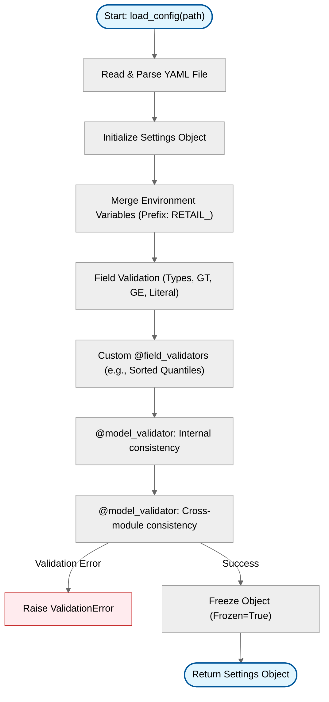

# Configuration Logic: `load_config`

This diagram illustrates how the Pydantic-based configuration system initializes and validates the experiment settings.

```mermaid
%%{init: { 
  'theme': 'neutral', 
  'flowchart': { 'htmlLabels': false }
} }%%
graph TD
    Start(["Start: load_config(path)"]) --> ReadYAML["Read & Parse YAML File"]
    ReadYAML --> InitSettings["Initialize Settings Object"]
    
    InitSettings --> EnvMerge["Merge Environment Variables (Prefix: RETAIL_)"]
    EnvMerge --> FieldVal["Field Validation (Types, GT, GE, Literal)"]
    
    FieldVal --> CustomFieldVal["Custom @field_validators (e.g., Sorted Quantiles)"]
    CustomFieldVal --> ModelVal["@model_validator: Internal consistency"]
    ModelVal --> CrossModuleVal["@model_validator: Cross-module consistency"]

    CrossModuleVal -- "Validation Error" --> Error["Raise ValidationError"]
    CrossModuleVal -- "Success" --> Freeze["Freeze Object (Frozen=True)"]
    
    Freeze --> Return(["Return Settings Object"])

    style Start fill:#e1f5fe,stroke:#01579b,stroke-width:2px
    style Return fill:#e1f5fe,stroke:#01579b,stroke-width:2px
    style Error fill:#ffebee,stroke:#c62828,stroke-width:1px
```
