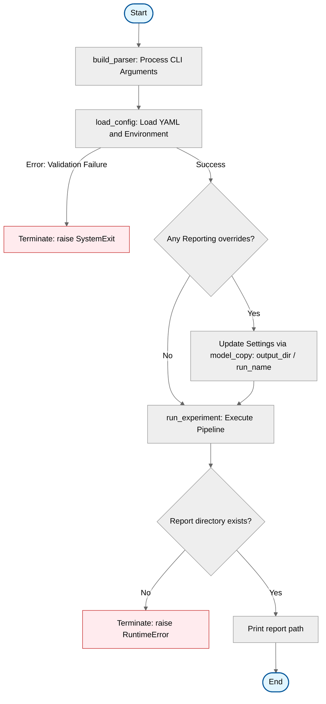

# Execution Flow: `run.py` (Main Logic)

This diagram strictly represents the operations contained within the system's main entry point.

```mermaid
%%{init: { 
  'theme': 'neutral', 
  'flowchart': { 'htmlLabels': false }
} }%%
graph TD
    Start([Start]) --> ParseArgs[build_parser: Process CLI Arguments]
    ParseArgs --> LoadConfig[load_config: Load YAML and Environment]
    
    LoadConfig -- "Error: Validation Failure" --> ExitError[Terminate: raise SystemExit]
    
    LoadConfig -- Success --> CheckOverride{Any Reporting overrides?}
    
    CheckOverride -- Yes --> UpdateSettings[Update Settings via model_copy: output_dir / run_name]
    CheckOverride -- No --> RunExperiment[run_experiment: Execute Pipeline]
    
    UpdateSettings --> RunExperiment
    
    RunExperiment --> CheckArtifacts{Report directory exists?}
    
    CheckArtifacts -- No --> RunError[Terminate: raise RuntimeError]
    CheckArtifacts -- Yes --> PrintResult[Print report path]
    
    PrintResult --> End([End])

    style Start fill:#e1f5fe,stroke:#01579b,stroke-width:2px
    style End fill:#e1f5fe,stroke:#01579b,stroke-width:2px
    style ExitError fill:#ffebee,stroke:#c62828,stroke-width:1px
    style RunError fill:#ffebee,stroke:#c62828,stroke-width:1px
```
