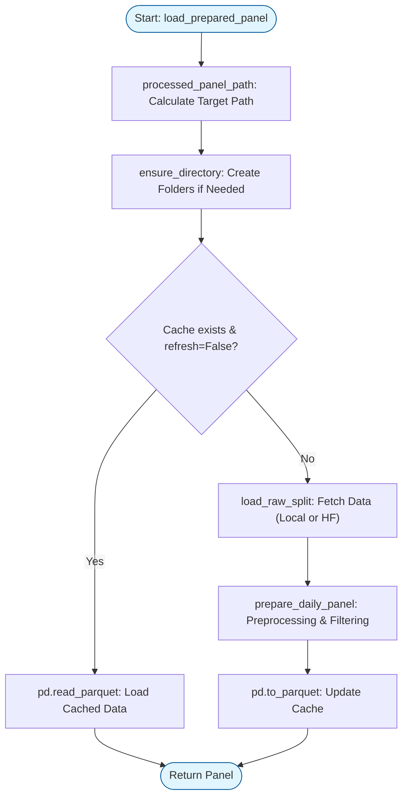

# Data Loading Flow: `load_prepared_panel`

This diagram illustrates the logic for loading and preparing the dataset panel, including the caching mechanism.

```mermaid
%%{init: { 'flowchart': { 'htmlLabels': false } } }%%
graph TD
    Start(["Start: load_prepared_panel"]) --> CalcPath["processed_panel_path: Calculate Target Path"]
    CalcPath --> EnsureDir["ensure_directory: Create Folders if Needed"]
    EnsureDir --> CheckCache{"Cache exists & refresh=False?"}
    
    CheckCache -- "Yes" --> LoadCache["pd.read_parquet: Load Cached Data"]
    LoadCache --> End(["Return Panel"])
    
    CheckCache -- "No" --> LoadRaw["load_raw_split: Fetch Data (Local or HF)"]
    LoadRaw --> Prepare["prepare_daily_panel: Preprocessing & Filtering"]
    Prepare --> SaveCache["pd.to_parquet: Update Cache"]
    SaveCache --> End

    style Start fill:#e1f5fe,stroke:#01579b
    style End fill:#e1f5fe,stroke:#01579b
```
