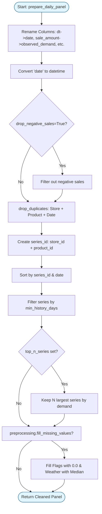

# Data Preparation Flow: `prepare_daily_panel`

This diagram illustrates the sequence of cleaning, filtering, and feature preparation steps required to transform raw data into a modeling-ready daily panel.

