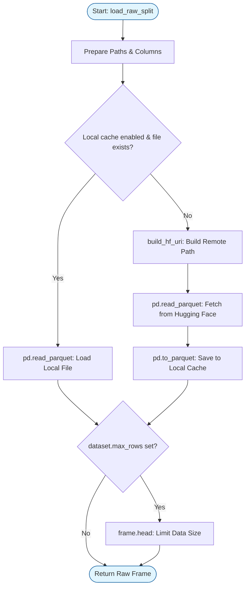

# Raw Data Retrieval Flow: `load_raw_split`

This diagram illustrates the logic for fetching raw dataset splits from local cache or remote Hugging Face storage.

```mermaid
%%{init: { 'flowchart': { 'htmlLabels': false } } }%%
graph TD
    Start(["Start: load_raw_split"]) --> Setup["Prepare Paths & Columns"]
    Setup --> CheckLocal{"Local cache enabled & file exists?"}
    
    CheckLocal -- "Yes" --> LoadLocal["pd.read_parquet: Load Local File"]
    LoadLocal --> CheckRows
    
    CheckLocal -- "No" --> BuildURI["build_hf_uri: Build Remote Path"]
    BuildURI --> LoadRemote["pd.read_parquet: Fetch from Hugging Face"]
    LoadRemote --> SaveCache["pd.to_parquet: Save to Local Cache"]
    SaveCache --> CheckRows

    CheckRows{"dataset.max_rows set?"}
    CheckRows -- "Yes" --> Slice["frame.head: Limit Data Size"]
    CheckRows -- "No" --> End(["Return Raw Frame"])
    Slice --> End

    style Start fill:#e1f5fe,stroke:#01579b
    style End fill:#e1f5fe,stroke:#01579b
```
