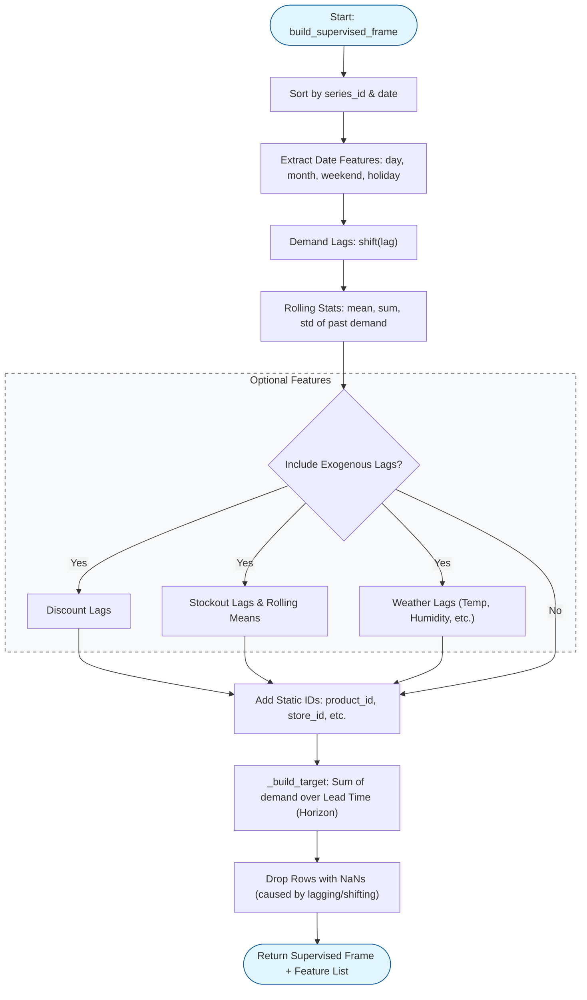

# Feature Engineering Flow: `build_supervised_frame`

This diagram illustrates the process of transforming a daily panel into a supervised learning frame with features and targets.

```mermaid
%%{init: { 'flowchart': { 'htmlLabels': false } } }%%
graph TD
    Start(["Start: build_supervised_frame"]) --> Sort["Sort by series_id & date"]
    Sort --> DateFeat["Extract Date Features: day, month, weekend, holiday"]
    
    DateFeat --> Lags["Demand Lags: shift(lag)"]
    Lags --> Rolling["Rolling Stats: mean, sum, std of past demand"]
    
    Rolling --> Exog{"Include Exogenous Lags?"}
    
    subgraph Exogenous_Features ["Optional Features"]
        Exog -- "Yes" --> Discount["Discount Lags"]
        Exog -- "Yes" --> Stockout["Stockout Lags & Rolling Means"]
        Exog -- "Yes" --> Weather["Weather Lags (Temp, Humidity, etc.)"]
    end
    
    Discount --> Static["Add Static IDs: product_id, store_id, etc."]
    Stockout --> Static
    Weather --> Static
    Exog -- "No" --> Static

    Static --> Target["_build_target: Sum of demand over Lead Time (Horizon)"]
    
    Target --> Cleaning["Drop Rows with NaNs (caused by lagging/shifting)"]
    Cleaning --> End(["Return Supervised Frame + Feature List"])

    style Start fill:#e1f5fe,stroke:#01579b
    style End fill:#e1f5fe,stroke:#01579b
    style Exogenous_Features fill:#f8f9fa,stroke:#333,stroke-dasharray: 5 5
```
