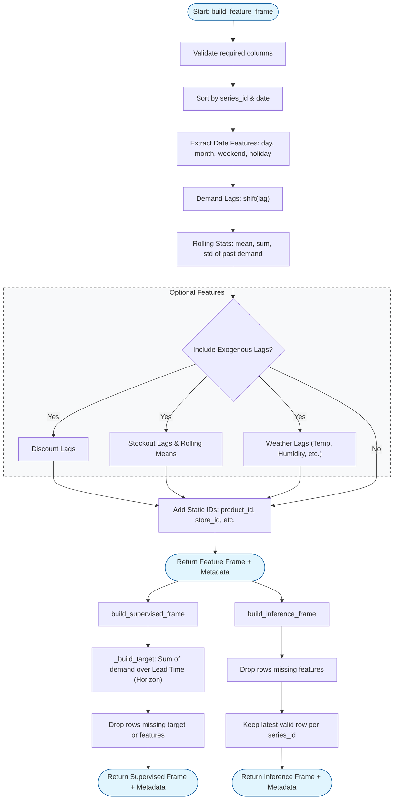

# Feature Engineering Flow

This diagram illustrates the shared feature transformation used by both supervised training/backtesting and inference.

```mermaid
%%{init: { 'flowchart': { 'htmlLabels': false } } }%%
graph TD
    Start(["Start: build_feature_frame"]) --> Validate["Validate required columns"]
    Validate --> Sort["Sort by series_id & date"]
    Sort --> DateFeat["Extract Date Features: day, month, weekend, holiday"]
    
    DateFeat --> Lags["Demand Lags: shift(lag)"]
    Lags --> Rolling["Rolling Stats: mean, sum, std of past demand"]
    
    Rolling --> Exog{"Include Exogenous Lags?"}
    
    subgraph Exogenous_Features ["Optional Features"]
        Exog -- "Yes" --> Discount["Discount Lags"]
        Exog -- "Yes" --> Stockout["Stockout Lags & Rolling Means"]
        Exog -- "Yes" --> Weather["Weather Lags (Temp, Humidity, etc.)"]
    end
    
    Discount --> Static["Add Static IDs: product_id, store_id, etc."]
    Stockout --> Static
    Weather --> Static
    Exog -- "No" --> Static

    Static --> SharedEnd(["Return Feature Frame + Metadata"])

    SharedEnd --> Supervised["build_supervised_frame"]
    Supervised --> Target["_build_target: Sum of demand over Lead Time (Horizon)"]
    Target --> TrainClean["Drop rows missing target or features"]
    TrainClean --> TrainEnd(["Return Supervised Frame + Metadata"])

    SharedEnd --> Inference["build_inference_frame"]
    Inference --> InferenceClean["Drop rows missing features"]
    InferenceClean --> Latest["Keep latest valid row per series_id"]
    Latest --> InferenceEnd(["Return Inference Frame + Metadata"])

    style Start fill:#e1f5fe,stroke:#01579b
    style SharedEnd fill:#e1f5fe,stroke:#01579b
    style TrainEnd fill:#e1f5fe,stroke:#01579b
    style InferenceEnd fill:#e1f5fe,stroke:#01579b
    style Exogenous_Features fill:#f8f9fa,stroke:#333,stroke-dasharray: 5 5
```
