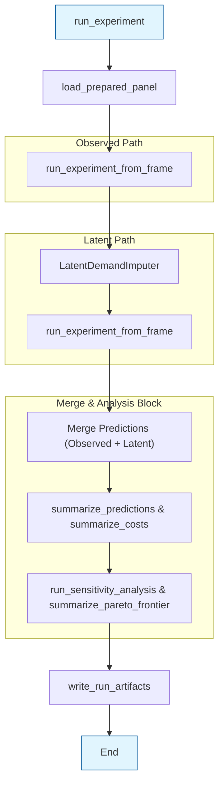

# Experiment Flow: `run_experiment` Pipeline

This diagram illustrates the end-to-end experiment pipeline, comparing Observed demand vs. Latent (imputed) demand strategies.

```mermaid
%%{init: { 'flowchart': { 'htmlLabels': false } } }%%
graph TD
    Start["run_experiment"] --> F1["load_prepared_panel"]

    subgraph StratA ["Observed Path"]
        F2["run_experiment_from_frame"]
    end
    F1 --> F2

    subgraph StratB ["Latent Path"]
        F3["LatentDemandImputer"] --> F4["run_experiment_from_frame"]
    end
    F2 --> F3

    subgraph ResultsMerge ["Merge & Analysis Block"]
        F5_0["Merge Predictions (Observed + Latent)"]
        F5["summarize_predictions & summarize_costs"]
        F6["run_sensitivity_analysis & summarize_pareto_frontier"]
        F5_0 --> F5
        F5 --> F6
    end
    F4 --> F5_0

    F6 --> F7["write_run_artifacts"]
    F7 --> End["End"]

    style Start fill:#e1f5fe,stroke:#01579b
    style End fill:#e1f5fe,stroke:#01579b
```
