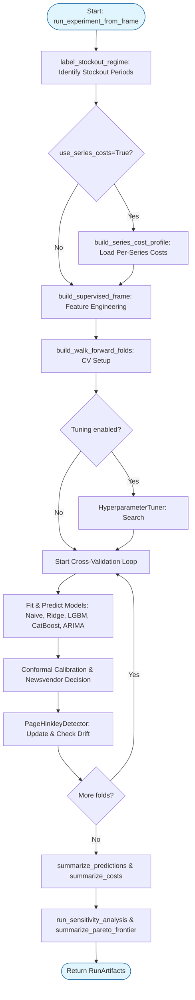

# Strategy Execution Flow: `run_experiment_from_frame`

This diagram details the internal execution pipeline for a specific data strategy (Observed or Latent).

```mermaid
%%{init: { 'flowchart': { 'htmlLabels': false } } }%%
graph TD
    Start(["Start: run_experiment_from_frame"]) --> F1["label_stockout_regime: Identify Stockout Periods"]
    
    F1 --> UseSeriesCosts{"use_series_costs=True?"}
    UseSeriesCosts -- "Yes" --> F1_1["build_series_cost_profile: Load Per-Series Costs"]
    UseSeriesCosts -- "No" --> F2["build_supervised_frame: Feature Engineering"]
    F1_1 --> F2
    F2 --> F3["build_walk_forward_folds: CV Setup"]
    
    F3 --> Tuning{"Tuning enabled?"}
    Tuning -- "Yes" --> Optuna["HyperparameterTuner: Search"]
    Tuning -- "No" --> Loop["Start Cross-Validation Loop"]
    Optuna --> Loop

    Loop --> FitPredict["Fit & Predict Models: Naive, Ridge, LGBM, CatBoost, ARIMA"]
    FitPredict --> Calibrate["Conformal Calibration & Newsvendor Decision"]
    
    Calibrate --> Drift["PageHinkleyDetector: Update & Check Drift"]
    Drift --> NextFold{"More folds?"}
    NextFold -- "Yes" --> Loop
    
    NextFold -- "No" --> Finalize["summarize_predictions & summarize_costs"]
    Finalize --> Sens["run_sensitivity_analysis & summarize_pareto_frontier"]
    Sens --> End(["Return RunArtifacts"])

    style Start fill:#e1f5fe,stroke:#01579b
    style End fill:#e1f5fe,stroke:#01579b
```
