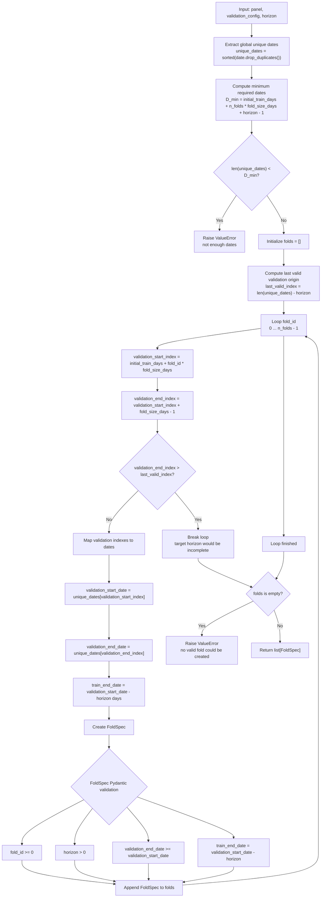

# Walk-Forward Fold Construction

This diagram documents the control flow of `build_walk_forward_folds()`.

Key points:

- Folds are built over the panel's global calendar of unique dates, not per-series calendars.
- Validation windows move forward by `fold_size_days` for each `fold_id`.
- `last_valid_index` prevents validation origins whose target horizon would be incomplete.
- `FoldSpec` validates the temporal gap and basic fold invariants at runtime.
