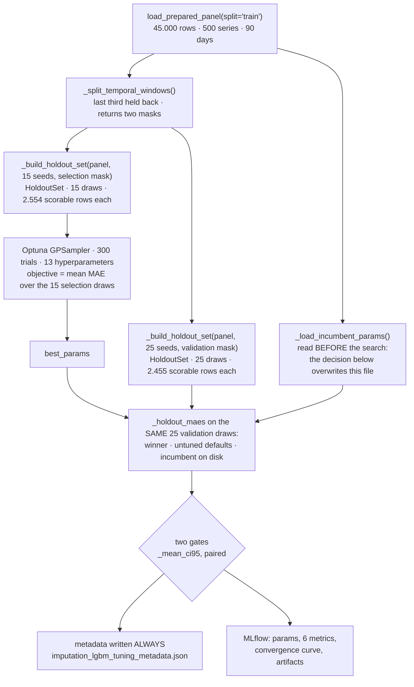
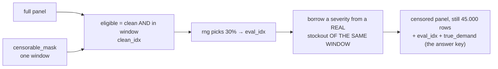
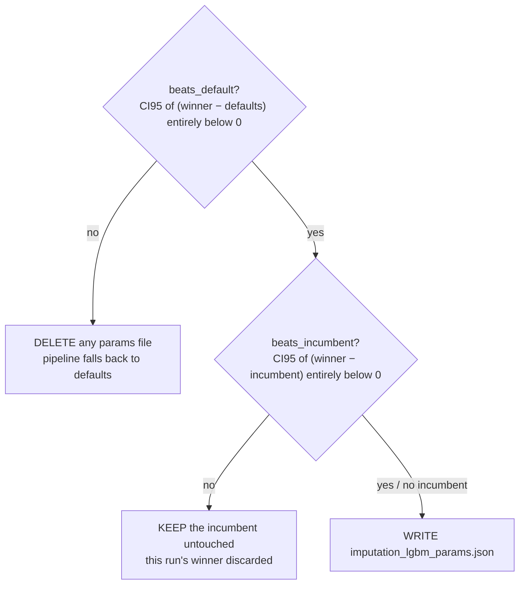

# `tune_imputation_lgbm` — flow

Hyperparameter search for the supervised imputer's LGBM teacher (`run_mode = tune_imputation`).
It tunes the model that reconstructs stockout-censored demand — **not** the forecasting model.

## Main flow

## The draws

One **holdout** is one round of a hiding game, built by `synthetic_censor_holdout`. A
**`HoldoutSet`** is every draw over one window, and it owns the window's boundary dates and
derived counts so the caller never re-derives them:

Three things to note:

- Only **clean** days can be faked. On a real stockout the true demand is unknown, so there
  would be nothing to score against.
- The mask restricts **both** populations — which rows get faked *and* where the severities come
  from. Restricting only the first was a defect: the early window's real stockouts hide 43.4% of
  a day against the late window's 30.5%, so late-window rows were being censored ~32% harder
  than they ever are, erasing on the severity axis the regime shift a temporal holdout exists to
  measure.
- The seeds only pick **which lottery is played**. They no longer separate the two sets — the
  masks do that, so a selection draw cannot reach a validation row even under an identical seed.

## The two gates

Both decide on the **interval**, never the sign of the mean: a mean that merely lands below zero
is what a coin flip looks like. A winner once cleared a point comparison at −1.14% and then
measured −0.45% with a straddling interval on fresh draws.

Note the interval is about the **mean** difference, not about every draw — a challenger can lose
several individual draws and still pass, and can win on a minority of draws yet fail.

The failure branches are deliberately **asymmetric**:

- failing the *defaults* gate means this run rejected tuning altogether, so a file left by an
  earlier run must not survive
- failing only the *incumbent* gate means tuning does work and the file on disk is a better
  validated winner, so deleting it would be absurd

Why two gates at all: the first is blind to the incumbent, so a worse search silently replaced a
better one — a run measuring −4.65% overwrote a −5.33% winner, having scored *better* on the
selection draws it was optimizing and worse on the held-out ones. Textbook selection-set
overfitting, invisible to a defaults-only gate.

## Outputs

| Path                                                | When                      | Contains                                                             |
| --------------------------------------------------- | ------------------------- | -------------------------------------------------------------------- |
| `models_dir/imputation_lgbm_params.json`          | only when both gates pass | the 13 winning hyperparameters, nothing else                         |
| `models_dir/imputation_lgbm_tuning_metadata.json` | always                    | both comparisons, the decision and why                               |
| `models_dir/imputation_tuning_studies.db`         | always                    | every trial, one Optuna study per run                                |
| `mlflow.db`                                       | always                    | params, metrics, convergence curve, the two files above as artifacts |

Only hyperparameters are persisted, never fitted weights — the imputer still re-fits on each
panel it is handed, so a search cannot change imputation's leakage or feature-space properties.

The return value is the params path when persisted, otherwise the metadata path.

## Known limits

- **One window, no seed.** The cut is deterministic (the last third), so exactly one period is
  ever tested. If the late calendar is peculiar the verdict inherits that and nothing reveals it.
  Validating over several windows would fix this and costs almost nothing, since validation runs
  three times per search rather than 300.
- **Blind to panel overfitting.** Both windows share the panel, so unlike a series partition this
  cannot detect hyperparameters overfitted to the panel itself, only to the window.
- **`n_estimators` is capped for compute, not by LightGBM.** What the cap forfeits must be
  measured, not assumed: at 3000 it costs 0.0037 of MAE, below the ~0.0059 width of the interval
  that decides the gates, so it cannot flip either verdict. Check the winner is not pinned *at*
  the cap regardless.
- **The params file has no scale tag.** `teacher_fit_rows` lives in the metadata, not in the
  params file, so nothing stops a 50-series search overwriting a 500-series winner — and the
  incumbent gate would allow it, because at 50 series the 50-series params genuinely win.
